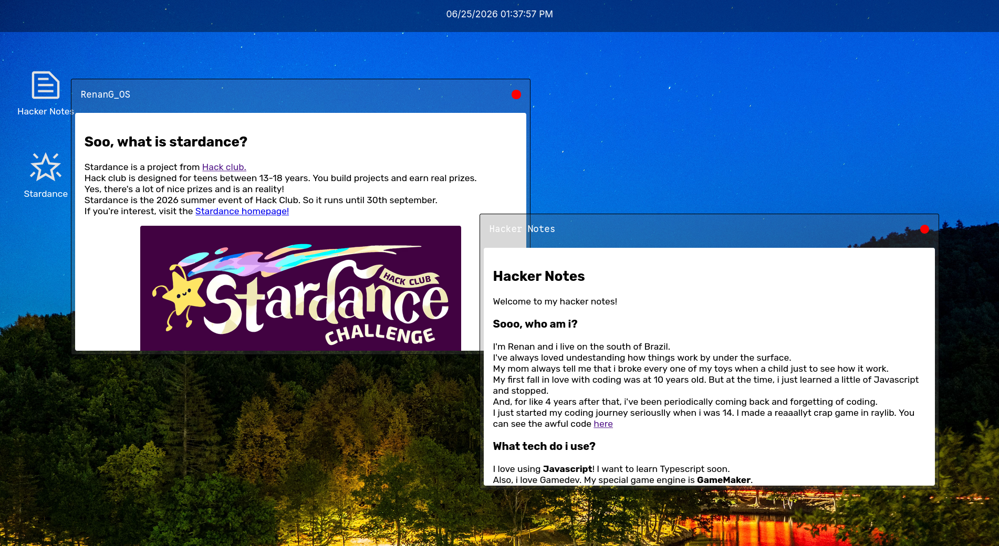

# RenanG_OS
A small web-os developed for Hack Club Stardance.

## Features
- Multiple draggable windows
- Z-ordering by last active window
- Hacker Notes app
- Stardance Info app.

## Technologies
I used:
- Javascript
- CSS
- HTML
And only these 3. I also used Google fonts for icon searching and font selection.

## Roadmap
- [] Custom background feature
- [] Minimize animations
- [] Calculator app
- [] Terminal app

## Join Stardance!
Hack Club is a non-profit organization that helps teens build real stuff. If you're between 13-18 years old, consider jopin us at https://https://hackclub.com/.

## Note
The mailme link only works if you have an active e-mail client, like Outlook or Thunderbird.
Or just use any web-based client to contact me! :p